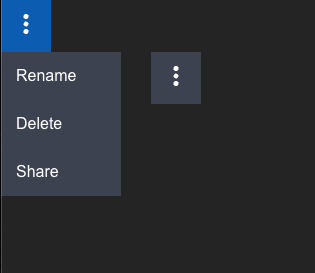

<h4 align="center"> 
    Concepta Front End Developer Test
</h4>

## :rocket: CodeSandbox

You can test the application here (https://codesandbox.io/s/dropdownmenu-cqip3k)

## :rocket: Technologies
This project was developed with the following technologies

- [React](https://reactjs.org)
- [Vite.js](https://vitejs.dev/) 
- [Typescript](https://www.typescriptlang.org/) 


## :page_with_curl: How to run
- **Clone**
    - ```cd DropDownMenu```
    - ```yarn```
    - ```yarn dev``` `

## :computer: Web:heavy_check_mark:

<h1 align="center">
    
</h1>

# To do:

* ***Unitary Tests***
* ***Implement Styled Components***
* ***Fake API***

## :memo: License

This project is under the MIT license. see the file [LICENSE](LICENSE) for more details.

<h4 align="center">
    Made With 💜 by <a href="https://www.linkedin.com/in/thiagomagalhaesme/" target="_blank">Pablo T. Magalhães</a>
</h4>